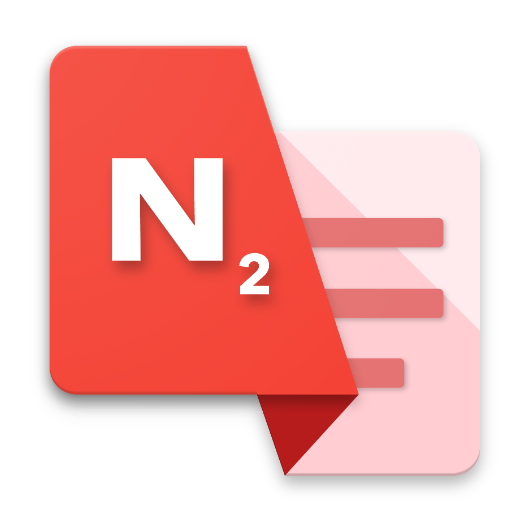
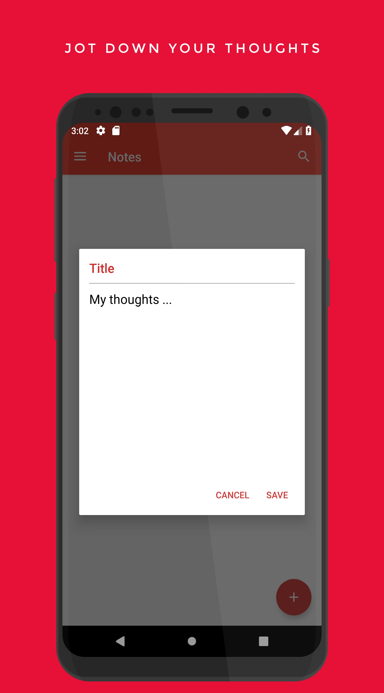
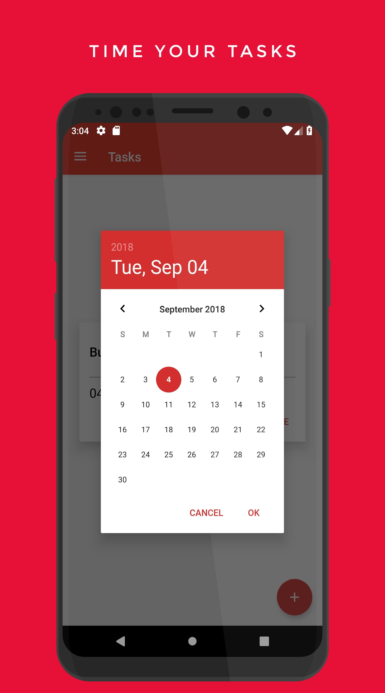
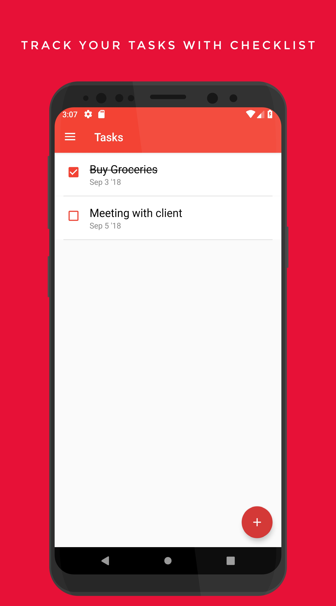
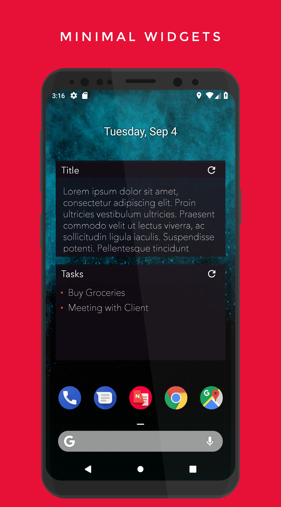

## RedNotes

aka Nitrogen Notes is an offline simple, fluid & material-designed Android Note/Task input application. It has all the basic & essential features for a note/task-reminder app and we also have plans to add more useful features  & better UX.<br/>

<div style="display:flex;" >
<a href="https://play.google.com/store/apps/details?id=notes.rednitrogen.com.rednotes.free">
    
</a>
</div>
</br></br>

## Screenshots
<div style="display:flex;" >






</div>

### Features
- Offline SQLite Database
- Add, Edit, Copy, Share Notes. Add to notification for quick view.
- Search notes by keywords
- Swipe to Delete
- Limited time Trash
- Tasks with reminder
- Widgets for Notes and unchecked Tasks
- Ads and Ad-free(paid) app versions

### Upcoming features / To-Do
- [ ] update : Night Mode
- [ ] update : bottom sheet instead of actiondialog
- [ ] update : Fingerprint authentication
- [ ] update : export and import db
- [ ] update : Google now integration

### Feedback suggestions
- [ ] blank page > no fab > click on page to add
- [ ] tap on note > open editor in a different screen
- [ ] ellipsis-v icon to get other options
- [x] notify of an update

## Libraries
[](https://github.com/MiguelCatalan/MaterialSearchView)<br>
[](https://github.com/scottyab/rootbeer)<br>
[](https://github.com/wdullaer/MaterialDateTimePicker)<br>
[](https://jitpack.io/#jakebonk/NotifyMe)<br>

## Support Development

[](https://www.buymeacoffee.com/sdnitrogen) <br> 
[](https://www.paypal.me/sdnitrogen)

## License
[](https://opensource.org/licenses/Apache-2.0)<br>
```
Copyright [2018] [Red Nitrogen , AssassiNCrizR]

   Licensed under the Apache License, Version 2.0 (the "License");
   you may not use this file except in compliance with the License.
   You may obtain a copy of the License at

     http://www.apache.org/licenses/LICENSE-2.0

   Unless required by applicable law or agreed to in writing, software
   distributed under the License is distributed on an "AS IS" BASIS,
   WITHOUT WARRANTIES OR CONDITIONS OF ANY KIND, either express or implied.
   See the License for the specific language governing permissions and
   limitations under the License.
```
